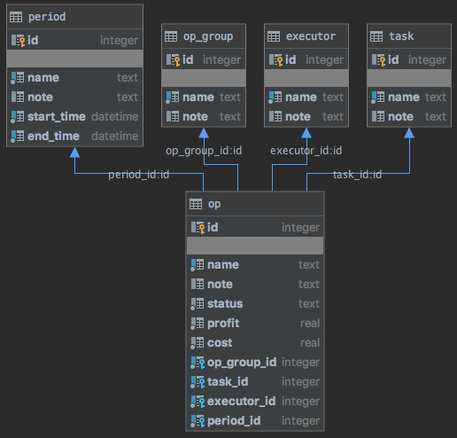
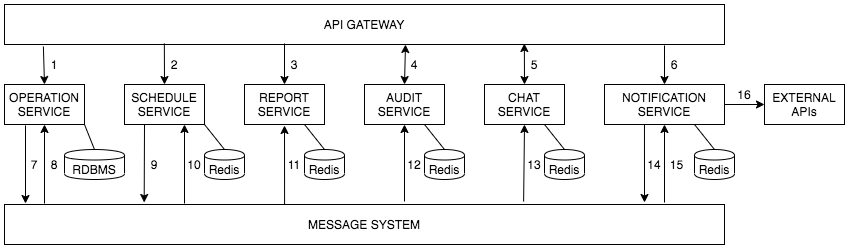
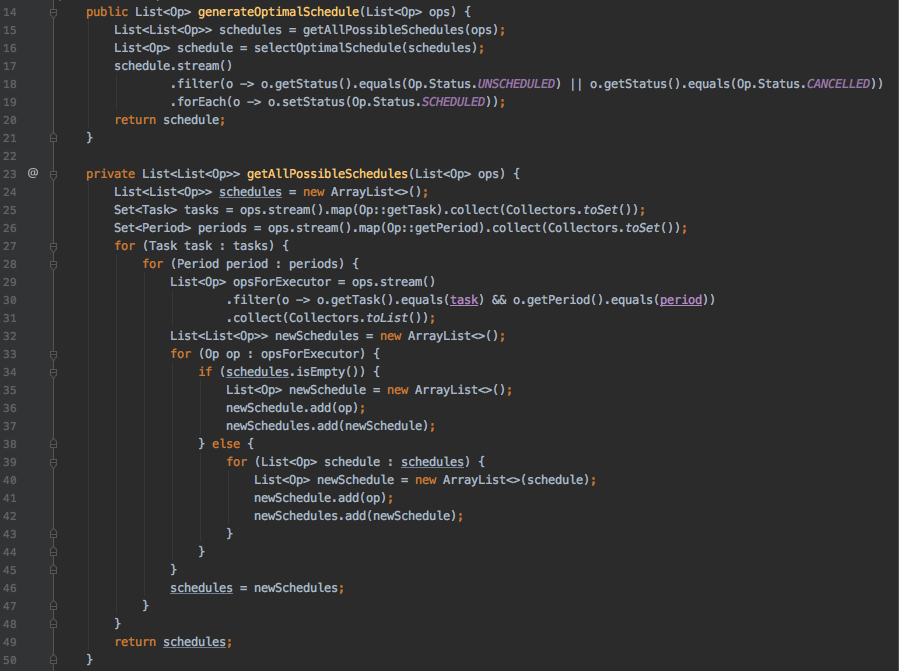
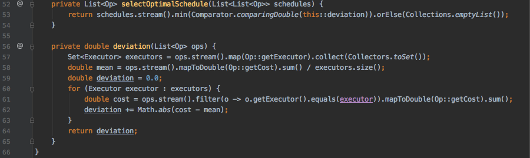

Distributed Information System manages operations, generates its optimal schedule, evaluates its metrics, tracks all activity in real-time, provides chat room, sends notifications.

### Table of Contents  
- [Use Case](#use-case)  
- [Domain Model](#domain-model)  
- [Data Model](#data-model)  
- [Optimisation Task and Solution](#optimisation-task-and-solution)  
- [Functional Requirements](#functional-requirements) 
- [Non-Functional Requirements](#non-functional-requirements) 
- [Architecture](#architecture) 
- [System Architecture Diagram](#system-architecture-diagram) 
- [Technologies](#technologies) 
- [Tools](#tools) 
- [Java 8 Optimisation Algorithm Implementation](#java-8-optimisation-algorithm-implementation) 
- [TODO](#todo) 

### Use Case  
to be done, plus PowerPoint presentation, who are potential users, what is business value, why this solution is better than similar exiting ones.  

### Domain Model  
* Task - name, note.  
* Executor - name, note.  
* Period - name, note, start timestamp, end timestamp.  
* Operation group - name, note.  
* Operation - name, note, status, profit, cost, operation group, task, executor, period.  
* Schedule - a set of operations, pair (task, period) is unique in the set.  

### Data Model  
  
[SQLite database schema](operation-service/src/main/resources/operation-manager-sqlite-schema.sql) 

### Optimisation Task and Solution  
Task: to generate a schedule, so that operations would be most uniformly distributed among executors.  
Solution: generate all possible schedules and choose the one with minimal deviation of operation profit/cost sum per executor from its mean value. 

### Functional Requirements  
* create/update/delete task/executor/period/operation/operation group.  
* generate an optimal schedule.  
* extract tasks/executors/periods/operations/operation groups/schedules/metrics.  
* extract and configurate real-time audit data.  
* provide a chat room with real-time instant messaging and topics by operation groups.   
* extract and configurate notification settings concerning schedule changes (e.g. Email, Phone, Telegram, WhatsApp).  

### Non-Functional Requirements   
* Concurrent modification and consistency of operation data is essential.  
* Generating optimal schedule is expected to take long time and much memory.  
* High availability of report data. 
* High availability of real-time audit data. 
* Notification configuration is expected to change and be extended frequently.  
* Sending notifications might take long time and be unreliable due to the dependency on external API.  

### Architecture  
Taking into consideration these requirements it has been decided to decouple Scheduler, Reporting, Audit, Chat and Notification into separate services, integrate them with Message System, use Redis in them, RDBMS in Operation Service.  
The Enterprise Application has a Microservices Architecture, implements CQRS (Command Query Responsibility Segregation) and Event Sourcing patterns of Event-Driven Architecture.  

### System Architecture Diagram  
  
1. REST API call to Operation Service to create/update/delete domain entities. 
2. REST API call to Schedule Service to initiate optimal schedule generation.  
3. REST API call to Report Service to extract domain entities, schedule, metrics.  
4. Call to Audit Service to establish Web Socket channel to extract real-time audit data.  
5. Call to Chat Service to enter Chat Room and establish instant messaging channel.  
6. REST API call to Notification Service to extract or modify notification configuration settings.  
7. Operation Service publishes an event to Message System about domain entities create/update/delete, or about schedule saving, or about failure to save schedule.    
8. Operation Service receives an event from Message System about a generated schedule.  
9. Schedule Service publishes an event to Message System about initiating to generate a schedule, or about a generated schedule.  
10. Schedule Service receives an event from Message System about failure to save schedule or change of operation.   
11. Report Service receives an event from Message System about domain entities create/update/delete, or about schedule saving.  
12. Audit Service receives an event from Message System.  
13. Chat Service receives an event from Message System about opertion group changes.  
14. Notification Service receives a schedule change event from Message System and sends notifications according to the configuration settings.  
15. Notification Service publishes an event to Message System about success/failure to send a notification.  

### Technologies 
* Java 8 
* Spring framework (Boot, Actuator, Web/MVC, Data, Test, Slf4j/Logback)
* Oracle Database (for MVP SQLite is to be used instead)  
* SQLite, JDBC, Apache DBCP (connection pooling framework)  
* Redis 
* Apache Kafka 
* Maven 
* ApiGateway 

### Tools 
* IntelliJ IDEA  
* PL/SQL Developer 
* JProfiler 
* Apache JMeter   
* Git 
* GitHub 
* Jenkins 
* app.diagram.net

### Java 8 Optimisation Algorithm Implementation 
[Optimisation Service](schedule-service/src/main/java/com/sergeykotov/operationmanager/scheduleservice/service/OptimisationService.java)  
 
 

### TODO 
* implement Report, Audit, Chat, Notification Services, ApiGateway, Kafka  
* devise an approximate, heuristic solution, probably using dynamic programming  
* add an ability to configurate Schedule Service to generate schedule in automatic mode when operations get modified